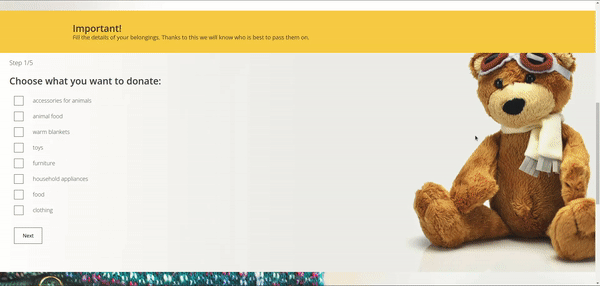

<div id="top"></div>


<br />
<div align="center">

<h3 align="center">Charity Donation App</h3>

  <p align="center">
    A web app for donating unnecessary items
    <br />
    <a href="https://github.com/ikolokotronis/Charity-Donation-App"><strong>Explore the docs »</strong></a>
    <br />
    <br />
    <a href="#donation-demo">View Demo</a>
    ·
    <a href="https://github.com/ikolokotronis/Charity-Donation-App/issues">Report Bug</a>
    ·
    <a href="https://github.com/ikolokotronis/Charity-Donation-App/issues">Request Feature</a>
  </p>
</div>


<!-- TABLE OF CONTENTS -->
<details>
  <summary>Table of Contents</summary>
  <ol>
    <li>
      <a href="#about-the-project">About The Project</a>
      <ul>
        <li><a href="#built-with">Built With</a></li>
      </ul>
    </li>
    <li>
      <a href="#getting-started">Getting Started</a>
      <ul>
        <li><a href="#prerequisites">Prerequisites</a></li>
        <li><a href="#installation">Installation</a></li>
      </ul>
    </li>
    <li><a href="#donation-demo">Donation demo</a></li>
    <li><a href="#contributing">Contributing</a></li>
    <li><a href="#contact">Contact</a></li>
  </ol>
</details>


<!-- ABOUT THE PROJECT -->
## About The Project

The aim of the project is to create a place where everyone can donate unnecessary things to trusted institutions.


Here's why:
* People have a lot of unwanted items at their homes.
* There are many solutions available, but most of them require additional effort or are mistrusted. You have to go to the verified places, and there is no time / there is no way to go there. Containers in neighbourhoods or local collections are unverified and it is not known whether your items will actually go to those in need.  
A solution is this web application, which will automate and speed up the donation process as well as make sure that all donated items will get to right and trusted hands.

<p align="right">(<a href="#top">back to top</a>)</p>


### Built With

* [Django](https://www.djangoproject.com/)
* [PostgreSQL](https://www.postgresql.org/)
* [Six](https://six.readthedocs.io/)

<p align="right">(<a href="#top">back to top</a>)</p>


<!-- GETTING STARTED -->
## Getting Started

This is an example of how to make this project run locally.

### Prerequisites

* pip
  ```sh
  pip install django
  ```
   ```sh
  pip install six
  ```
   ```sh
  pip install psycopg2-binary
  ```

### Installation
1. Clone the repo
   ```sh
   git clone https://github.com/ikolokotronis/Charity-Donation-App
   ```
2. Install PIP packages (shown above)
   
3. Enter your database settings in settings.py. Here is an example if you want to use PostgreSQL:
   ```python
   DATABASES = {
    'default': {
        'HOST': '127.0.0.1',
        'NAME': 'db_name_here',
        'ENGINE': 'django.db.backends.postgresql_psycopg2',
        'USER': 'user_name_here',
        'PASSWORD': 'password_here',
    }
    }
   ```
4. In your terminal, switch to the main directory (cd charity_donation_app/) and run python manage.py runserver
5. In settings.py change the email data to yours if you want to work with the django send_email function. *

"*" means optional


<p align="right">(<a href="#top">back to top</a>)</p>

## Donation demo



<!-- CONTRIBUTING -->
## Contributing

Any contributions you make are appreciated.

If you have a suggestion that would make this better, please fork the repo and create a pull request. You can also simply open an issue with the tag "enhancement".

1. Fork the Project
2. Create your Feature Branch (`git checkout -b branch_name/some_text`)
3. Commit your Changes (`git commit -m 'Commit name'`)
4. Push to the Branch (`git push origin branch_name/some_text`)
5. Open a Pull Request

<p align="right">(<a href="#top">back to top</a>)</p>


<!-- CONTACT -->
## Contact

Ioannis Kolokotronis - ioanniskolokotronis1@gmail.com

Project Link: [https://github.com/ikolokotronis/Charity-Donation-App]

<p align="right">(<a href="#top">back to top</a>)</p>
